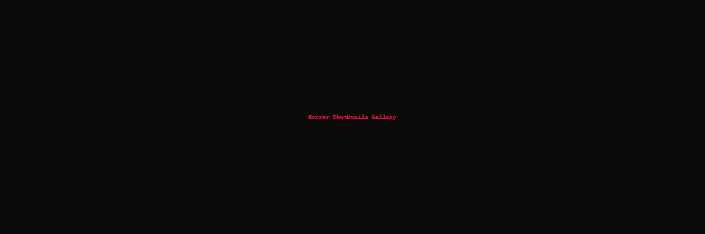

  

# 🎃 Horror Thumbnail Samples Gallery

Welcome!  
Below are 10 horror-themed YouTube thumbnail samples created for faceless horror channels.

Each thumbnail captures cinematic horror emotions — suspense, fear, and mystery.

---

## 📸 Gallery

<table>
  <tr>
    <td align="center">
       
      <b>She Knocked Three Times... Then Disappeared</b> 
      A shadowy figure with glowing eyes at a cracked door surrounded by mist.
    </td>
    <td align="center">
       
      <b>I Found a Hidden Room in My Basement</b> 
      A mysterious half-open basement door glowing with eerie light.
    </td>
  </tr>
  <tr>
    <td align="center">
       
      <b>The Sleep Experiment They Tried to Erase</b> 
      A restrained silhouette in a dark abandoned hospital room.
    </td>
    <td align="center">
       
      <b>Never Answer Unknown Calls at 3AM</b> 
      A glowing phone screen with a ghostly hand reaching toward it.
    </td>
  </tr>
  <tr>
    <td align="center">
       
      <b>Camping in the Woods: We Were Not Alone</b> 
      Misty forest with hidden glowing eyes watching the campsite.
    </td>
    <td align="center">
       
      <b>I Woke Up and Everyone Was Gone</b> 
      A lonely figure walking down an abandoned, fog-covered street.
    </td>
  </tr>
  <tr>
    <td align="center">
       
      <b>The Mirror Game That Went Terribly Wrong</b> 
      A cracked mirror revealing a twisted demonic reflection.
    </td>
    <td align="center">
       
      <b>The Thing That Lives Under My Bed</b> 
      A hand or glowing eyes emerging from under the bed in a dark room.
    </td>
  </tr>
  <tr>
    <td align="center">
       
      <b>They Warned Me About the Midnight Man</b> 
      A tall faceless shadow lurking at the end of a dark hallway.
    </td>
    <td align="center">
       
      <b>My Friend Was Replaced by Something Else</b> 
      A split face showing half-human, half-demonic transformation.
    </td>
  </tr>
</table>

---

✅ All thumbnails created using Pikzels.  
✅ Designed for cinematic horror faceless YouTube channels.

---

Thank you for reviewing these samples!  
Looking forward to collaborating on building an epic horror channel. 👻
